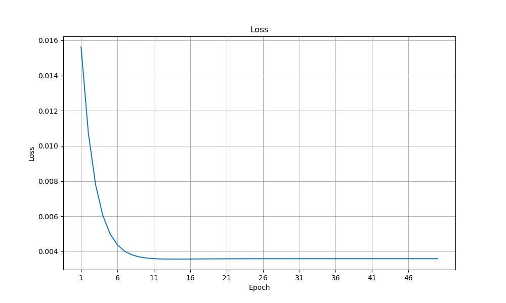

# LinearRegression
In statistics, linear regression is a statistical model which estimates the linear
relationship between a scalar response and one or more explanatory variables. In
linear regression, the relationships are modeled using linear predictor functions
whose unknown model parameters are estimated from the data.

[Take a look at the math](Linear_regression.pdf)

## Features
* Train the model
* Predict
* Plot (`Python` and `matplotlib` needed)
* Save model
* Load saved model

# Test

Ground truth  | Prediction
------------- | -------------
0.5 0.65 0.80 0.60  | 0.40 0.71 0.84 0.58

