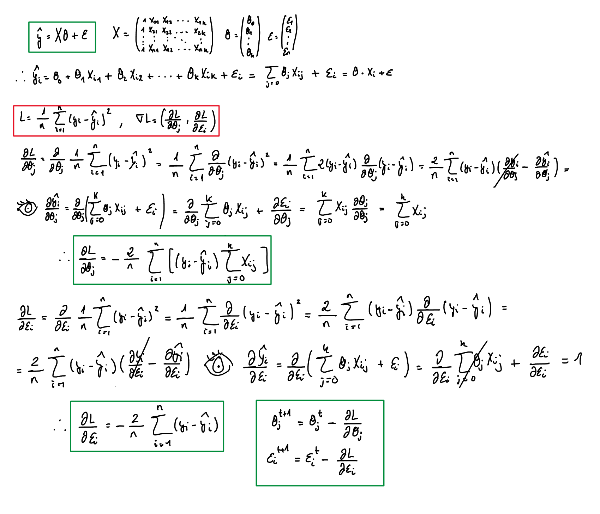

# LinearRegression
LinearRegression and gradient descent from scratch.

# Algorithm

**Weights and biases**

* Generate weights vector (uniformly distributed): $\theta$
* Generate the biases vector with random numbers [0,1]: $\varepsilon$.

**Training**

* (1) Compute linear regression: 
$$\hat{y} = X \theta + \varepsilon$$
* (2) Compute loss function and its gradient:
$$\nabla L = \left( \frac{\partial L}{\partial \theta_{j}}, \frac{\partial L}{\partial \varepsilon_{i}} \right)$$
* (3) Apply gradient descent: 
$$\theta^{t+1}_{j} = \theta^{t}_{j} + \gamma \frac{\partial L}{\partial \theta_{j}}$$
$$\varepsilon^{t+1}_{i} = \varepsilon^{t}_{i} + \gamma \frac{\partial L}{\partial \varepsilon_{i}}$$
* (4) Go back to step 1 for a specified number of epochs.

# Math


# Test

Ground truth  | Prediction
------------- | -------------
0.5 0.65 0.80 0.60  | 0.40 0.71 0.84 0.58


```
Epoch 1: loss -> 0.015625
Epoch 2: loss -> 0.010727
Epoch 3: loss -> 0.00778853
Epoch 4: loss -> 0.00603281
Epoch 5: loss -> 0.00498947
Epoch 6: loss -> 0.00437399
Epoch 7: loss -> 0.00401452
Epoch 8: loss -> 0.00380747
Epoch 9: loss -> 0.00369056
Epoch 10: loss -> 0.00362649
Epoch 11: loss -> 0.00359301
Epoch 12: loss -> 0.00357692
Epoch 13: loss -> 0.00357046
Epoch 14: loss -> 0.00356913
Epoch 15: loss -> 0.00357035
Epoch 16: loss -> 0.00357267
Epoch 17: loss -> 0.00357532
Epoch 18: loss -> 0.00357788
Epoch 19: loss -> 0.00358019
Epoch 20: loss -> 0.00358218
Epoch 21: loss -> 0.00358385
Epoch 22: loss -> 0.00358522
Epoch 23: loss -> 0.00358633
Epoch 24: loss -> 0.00358722
Epoch 25: loss -> 0.00358793
Epoch 26: loss -> 0.00358849
Epoch 27: loss -> 0.00358893
Epoch 28: loss -> 0.00358928
Epoch 29: loss -> 0.00358956
Epoch 30: loss -> 0.00358978
Epoch 31: loss -> 0.00358994
Epoch 32: loss -> 0.00359008
Epoch 33: loss -> 0.00359018
Epoch 34: loss -> 0.00359026
Epoch 35: loss -> 0.00359032
Epoch 36: loss -> 0.00359037
Epoch 37: loss -> 0.00359041
Epoch 38: loss -> 0.00359044
Epoch 39: loss -> 0.00359047
Epoch 40: loss -> 0.00359048
Epoch 41: loss -> 0.0035905
Epoch 42: loss -> 0.00359051
Epoch 43: loss -> 0.00359052
Epoch 44: loss -> 0.00359053
Epoch 45: loss -> 0.00359053
Epoch 46: loss -> 0.00359053
Epoch 47: loss -> 0.00359054
Epoch 48: loss -> 0.00359054
Epoch 49: loss -> 0.00359054
Epoch 50: loss -> 0.00359054
```